# Plano de Implementação: Modelagem Estatística da Qualidade de Vinhos (TP1 - RegCatOrd)

Este documento estabelece o plano analítico, metodológico e computacional para o **Trabalho Prático 1** da disciplina de *Regressão para Dados Categóricos e Ordinais* (UFMG - EST171), ministrada pelo Prof. Cristiano de Carvalho Santos.

O trabalho tem como objetivo investigar a avaliação de qualidade de vinhos através de modelos de regressão para dados ordinais (logitos acumulados sob suposição de chances proporcionais e extensões), diagnósticos avançados de resíduos substitutos, colapsamento/dicotomização binária, contraste entre Razão de Chances e Risco Relativo, e fundamentação dos ganhos da abordagem Bayesiana.

---

## 1. Olhar Analítico e Definição das Variáveis

A percepção sensorial e a avaliação crítica de vinhos são fenômenos naturalmente latentes. Críticos especializados pontuam garrafas em escalas padronizadas (escala de 100 pontos da *Wine Enthusiast* / *Wine Spectator*), nas quais a nota reflete níveis ordenados de qualidade, mas não distâncias euclidianas uniformes (a diferença entre 85 e 87 pontos possui implicações sensoriais e comerciais distintas da transição entre 98 e 100 pontos).

### 1.1 Variável Resposta ($Y$)

* **Escala Original**: `points` (número inteiro variando de 80 a 100).
* **Operacionalização Ordinal ($J$ categorias ordenadas)**:
  * **Estratégia Recomendada (Padrão de Mercado Enológico - 4 ou 5 Categorias)**:
    1. *C1 - Regular / Acessível* ($80 \le \text{points} \le 84$): Vinhos de entrada/cotidianos.
    2. *C2 - Bom / Muito Bom* ($85 \le \text{points} \le 87$): Vinhos com boa tipicidade e custo-benefício.
    3. *C3 - Excelente / Recomendado* ($88 \le \text{points} \le 91$): Vinhos finos com complexidade.
    4. *C4 - Superior / Excepcional* ($92 \le \text{points} \le 100$): Vinhos de alto prestígio e guarda.
  * *Alternativa Paramétrica*: Quantis empíricos ($K = 5$), como já esboçado no script atual ($[80,86], (86,88], (88,89], (89,91], (91,100]$), garantindo balanceamento amostral exato entre classes.
* **Operacionalização Dicotômica ($Y_{bin}$)**:
  * Agrupamento binário fundamentado na literatura e no mercado vitivinícola:
    $$Y_{bin} = \begin{cases} 1 \ (\text{Vinho Premium / Medalha de Ouro}), & \text{se } \text{points} \ge 90 \\ 0 \ (\text{Vinho Padrão / Comercial}), & \text{se } \text{points} < 90 \end{cases}$$
  * **Justificativa Substantiva**: A barreira dos 90 pontos (*the 90-point barrier*) é o divisor de águas mundial da indústria do vinho; pontuações $\ge 90$ garantem destaque comercial, valorização de leilão e selos de recomendação.

### 1.2 Variáveis Explicativas (Covariáveis $X$)

1. **Preço da Garrafa (`price` $\to \log(\text{price})$)**:
   * *Formulação*: Transformação logarítmica $\log(\text{price})$ ou padronização.
   * *Justificativa*: A distribuição de preços apresenta forte assimetria à direita (variando de US\$ 4 a US\$ 3.300). Na teoria microeconômica e sensorial, o retorno marginal da pontuação em relação ao investimento financeiro é decrescente (elasticidade logarítmica).
2. **Origem Geográfica / Terroir (`country` ou Macrorregião)**:
   * *Desafio*: O dataset possui 43 países, gerando problemas de esparsidade amostral nas caudas (Slide 2, p. 40-42).
   * *Formulação*: 
     * Opção A: Top 6 países produtores (EUA, França, Itália, Espanha, Portugal, Chile) + "Outros".
     * Opção B (Agrupamento Teórico Enológico): *Velho Mundo* (França, Itália, Espanha, Portugal, Alemanha, Áustria - tradição milenar, regulamentação estrita de terroir) vs. *Novo Mundo* (EUA, Chile, Argentina, Austrália, África do Sul, Brasil - maior liberdade enológica, vinhos focados na fruta) vs. *Outros*.
3. **Tipo de Casta / Variedade (`variety`)**:
   * *Formulação*: Agrupar nas castas mais representativas (Cabernet Sauvignon, Pinot Noir, Chardonnay, Syrah, Bordeaux Blend) e "Demais Variedades", ou agrupar por estilo (Tinto Encorpado, Tinto Leve, Branco, Rosé/Espumante).
4. **Efeito do Crítico / Avaliador (`taster_name`)**:
   * *Formulação*: Identificador dos principais avaliadores vs "Avaliador Não Informado". Controla a heterogeneidade da severidade sensorial de cada sommelier.

---

## 2. Hipóteses Substantivas e Conclusões Esperadas

* **$H_1$ (Elasticidade Positiva do Preço)**: $\beta_{\log(\text{price})} > 0$. Vinhos mais caros têm chances substantivamente maiores de atingir os estratos mais altos de pontuação. Espera-se uma Razão de Chances acumulada expressiva por dobra de preço ($OR > 2.0$).
* **$H_2$ (Prêmio de Qualidade do Velho Mundo)**: Condicional a um mesmo patamar de preço, vinhos do Velho Mundo (especialmente França e Itália) tendem a apresentar chances superiores de alcançar faixas de pontuação elevadas devido ao prestígio de suas denominações de origem controlada (AOC, DOCG).
* **$H_3$ (Rejeição da Suposição de Chances Proporcionais)**: Em decorrência do tamanho amostral elevado ($N > 100.000$) e da dinâmica não linear da relação preço-qualidade, o Teste de Brant e o Teste de Razão de Verossimilhança rejeitarão a hipótese nula de paralelismo estrito ($p < 0,05$). O efeito do preço tende a ser mais acentuado na transição para a categoria superlativa ($\ge 92$ ou $\ge 95$ pts) do que nas transições inferiores.
* **$H_4$ (Adequação do Modelo de Chances Proporcionais Parciais - PPOM)**: Relaxar o paralelismo apenas para $\log(\text{price})$ ou variáveis violadoras via `VGAM::vglm(..., family = cumulative(parallel = FALSE ~ ...))` proporcionará ganho de ajuste (menor AIC/Deviance) mantendo a interpretabilidade dos efeitos fixos das demais covariáveis.
* **$H_5$ (Trade-off do Colapsamento Binário)**: A dicotomização em $\ge 90$ pontos preservará a direção dos efeitos, mas sacrificará a capacidade do modelo de discriminar a variabilidade interna das caudas (não distingue 80 de 89, nem 90 de 100), reduzindo a eficiência estatística dos estimadores.

---

## 3. Fundamentação Teórica Detalhada (Conexão Direta com os Slides)

### 3.1 Teoria da Regressão Binária e Binomial (Slide 1 - Prof. Cristiano Santos)

* **Modelo Logístico**:
  $$\text{logit}(\pi_i) = \log\left(\frac{\pi_i}{1 - \pi_i}\right) = \beta_0 + \sum_{k=1}^p \beta_k x_{ik} = x_i^T \beta \implies \pi_i = \frac{\exp(x_i^T \beta)}{1 + \exp(x_i^T \beta)}$$
* **Funções de Ligação Alternativas** (Slide 1, p. 13-16): Probit ($\Phi^{-1}$) e Complementar Log-Log ($\log(-\log(1-\pi))$ - assimétrica).
* **Estimação e Inferência** (Slide 1, p. 33-35, 59-61):
  * Estimador de Máxima Verossimilhança (EMV) via Fisher Scoring.
  * Teste da Razão de Verossimilhanças (LRT) via estatística Deviance: $G^2 = D(\text{modelo reduzido}) - D(\text{modelo completo}) \sim \chi^2_q$.
  * Teste de Wald: $z = \hat{\beta}_k / \text{EP}(\hat{\beta}_k) \sim \mathcal{N}(0, 1)$.
* **Interpretação da Razão de Chances (OR)** (Slide 1, p. 20-26):
  $$OR = \frac{\text{chance}(x + 1)}{\text{chance}(x)} = \exp(\beta_k)$$
* **Métricas de Avaliação Preditiva** (Slide 1, p. 79-88):
  * Matriz de Confusão, Acurácia (e o alerta contra a ilusão da acurácia sob desbalanceamento, p. 81).
  * Sensibilidade, Especificidade, Curva ROC e Área sob a Curva (AUC).
* **Equívocos Conceituais Críticos: Razão de Chances (OR) vs. Risco Relativo (RR)** (*Exigência Obrigatória do TP1*):
  * *Definição de Risco Relativo*: $RR = \frac{P(Y=1|X=1)}{P(Y=1|X=0)} = \frac{\pi_1}{\pi_0}$.
  * *Definição de Razão de Chances*: $OR = \frac{\pi_1 / (1 - \pi_1)}{\pi_0 / (1 - \pi_0)} = RR \times \frac{1 - \pi_0}{1 - \pi_1}$.
  * *Equívoco 1*: Dizer que "vinhos caros têm chance 3 vezes maior de serem excepcionais significa que eles têm 3 vezes mais probabilidade de serem excepcionais". A chance é $\frac{\pi}{1-\pi}$, não $\pi$.
  * *Equívoco 2*: Interpretar $OR$ como $RR$ em eventos frequentes. Quando o evento não é raro (por exemplo, vinhos $\ge 90$ pts representam $\approx 35\%$ da base), o $OR$ afasta-se substancialmente do $RR$, superestimando a magnitude do efeito multiplicativo sobre a probabilidade. O $OR$ só aproxima o $RR$ sob a *suposição de evento raro* ($\pi \to 0 \implies 1-\pi \approx 1$).

### 3.2 Teoria dos Modelos para Dados Ordinais (Slide 2 - Prof. Cristiano Santos)

* **Motivação por Variável Latente** (Slide 2, p. 63-68):
  $$Y_i^* = \beta^T x_i + \epsilon_i, \quad Y_i = j \iff \alpha_{j-1} < Y_i^* \le \alpha_j$$
  onde $-\infty = \alpha_0 < \alpha_1 < \dots < \alpha_{J-1} < \alpha_J = +\infty$ são os limiares (*cutpoints*).
* **Modelo de Logitos Acumulados (Cumulative Logit Model)** (Slide 2, p. 51-58):
  $$\text{logit}[P(Y_i \le j | x_i)] = \log\left(\frac{P(Y_i \le j | x_i)}{P(Y_i > j | x_i)}\right) = \alpha_j - \beta^T x_i, \quad j = 1, \dots, J-1$$
* **Atenção Rigorosa à Convenção de Sinais entre Pacotes R** (Slide 2, p. 74-77):
  * **No `MASS::polr`**: usa $\alpha_j - \beta^T x_i$. Um coeficiente $\hat{\beta} > 0$ indica que o aumento de $x$ reduz a probabilidade acumulada nas classes inferiores ($P(Y \le j)$), ou seja, **desloca a distribuição para categorias superiores de qualidade** ($Y^*$).
  * **No `VGAM::vglm` ou convenção de Agresti**: usa $\alpha_j + \beta^T x_i$ (quando `reverse = FALSE`). Um coeficiente positivo nessa formulação aumenta $P(Y \le j)$, isto é, favorece categorias mais baixas. Na apresentação, essa distinção matemática deve ser formalmente destacada para demonstrar rigor metodológico.
* **Suposição de Chances Proporcionais (Paralelismo)** (Slide 2, p. 87-94):
  $$\frac{\text{odds}(Y \le j | x^{(1)})}{\text{odds}(Y \le j | x^{(2)})} = \exp(-\beta^T(x^{(1)} - x^{(2)})) \quad \forall j$$
  O vetor de inclinação $\beta$ é idêntico para todos os $J-1$ pontos de corte.
* **Diagnóstico da Suposição e Alternativas** (Slide 2, p. 89-98):
  1. *Teste de Brant* (`brant::brant(fit_polr)`): Testa individualmente cada covariável e omnibus via estatística assintótica $\chi^2$.
  2. *Teste de Razão de Verossimilhança no VGAM*: Comparar modelo com `parallel = TRUE` vs. `parallel = FALSE` via `lrtest`.
  3. *O Efeito do Tamanho Amostral $N$* (Slide 2, p. 93-94): Em grandes amostras, testes formais têm poder inflacionado e rejeitam $H_0$ mesmo para diferenças irrelevantes do ponto de vista substantivo. Não se deve descartar o modelo ordinal sumariamente.
  4. *Modelo de Chances Proporcionais Parciais (PPOM)* (Slide 2, p. 98): Permitir efeitos não-paralelos apenas para a covariável que viola substancialmente a suposição (`parallel = FALSE ~ log_price`).
  5. *Comparação com Colapsamento* (Slide 2, p. 95-96): Avaliar estabilidade dos $\beta$ entre cortes binários sucessivos.

### 3.3 Diagnóstico de Resíduos Substitutos com o Pacote `sure` (Slide 3 - Prof. Cristiano Santos)

* **Limitação dos Resíduos Tradicionais** (Slide 3, p. 12-13): Em respostas ordinais e binárias, resíduos brutos, de Pearson ou de Deviance geram padrões discretos em bandas paralelas no plano cartesiano, sendo incapazes de revelar curvaturas na estrutura de média ou heterocedasticidade.
* **Teoria dos Resíduos Substitutos (*Surrogate Residuals*)** (Liu & Zhang, 2017; Greenwell et al., 2018):
  * Gera-se uma variável contínua substituta $S_i | Y_i = j \sim F_{\text{truncada}}(\alpha_{j-1} - x_i^T\beta, \alpha_j - x_i^T\beta)$.
  * O resíduo substituto é dado por:
    $$R_i = S_i - E[S_i | x_i]$$
  * Se o modelo estiver corretamente especificado, $R_i$ se comporta exatamente como o resíduo contínuo da variável latente: média nula, homocedástico e aderente à distribuição teórica de referência.
* **Diagnósticos Gráficos via `sure::autoplot`** (Slide 3, p. 23-56):
  1. *QQ-Plot com Envelope Simulado*: Checagem da função de ligação (Logit vs. Probit vs. Cloglog).
  2. *Resíduos vs. Valores Ajustados*: Checagem da linearidade global.
  3. *Resíduos vs. Covariável $\log(\text{price})$*: Detecção de não-linearidades ou termos quadráticos omitidos.
  4. *Boxplots de Resíduos por Fatores*: Avaliação de heterocedasticidade entre países ou castas.

### 3.4 Ganho da Abordagem Bayesiana (*Exigência Obrigatória do TP1*)

* **Incorporação de Informação a Priori**: Possibilidade de introduzir conhecimento agronômico/enológico prévio via distribuições a priori (ex: priors regularizadoras $\mathcal{N}(0, \sigma^2)$ para evitar problemas de separação quase-completa em combinações raras de casta/país).
* **Inferência Exata em Amostras Finitas**: A inferência Bayesiana via MCMC (Stan / `brms`) não depende de aproximações assintóticas normais da teoria de Máxima Verossimilhança ($N \to \infty$).
* **Distribuições Posteriores Completas para Probabilidades e $OR$**: O cálculo de intervalos de credibilidade HPD (*Highest Posterior Density*) para razões de chances e predições probabilísticas é direto, eliminando a dependência do método Delta assintótico.
* **Modelagem Hierárquica / Efeitos Aleatórios**: Estruturação natural de efeitos aleatórios em multinível (ex: vinhos aninhados em vinícolas, vinícolas aninhadas em denominações de origem/regiões), o que frequentemente causa não-convergência numérica no EMV frequentista clássico.

---

## 4. Estrutura Detalhada da Apresentação (20 Minutos / 3 Integrantes)

> [!IMPORTANT]
> **Regra Mandatória do Professor**: A interpretação dos resultados **NÃO** deve estar escrita nos slides. Os slides devem conter exclusivamente: títulos conceituais, equações formais em LaTeX, tabelas de saídas estatísticas e gráficos de alta qualidade visual. Toda a interpretação deve ser articulada **oralmente** pelos estudantes a partir dos elementos visuais.

### Divisão do Tempo e das Seções

* **Tempo Total**: 20 minutos ($\approx 6$ a 7 minutos por integrante).
* **Total de Slides**: 15 slides (ritmo ideal de $\approx 1{,}2$ a $1{,}5$ min por slide).

```mermaid
flowchart LR
    subgraph Bloco1["Integrante 1 (00:00 - 06:40)"]
        direction TB
        S1["Slide 1: Introdução & Contexto Enológico"]
        S2["Slide 2: A Variável Latente Y*"]
        S3["Slide 3: EDA I - Resposta Ordinal & Preço"]
        S4["Slide 4: EDA II - Mapa Global de Qualidade"]
        S5["Slide 5: Teoria do Modelo de Logitos Acumulados"]
    end

    subgraph Bloco2["Integrante 2 (06:40 - 13:20)"]
        direction TB
        S6["Slide 6: Resultados do Modelo Ordinal"]
        S7["Slide 7: Teste de Brant & LRT de Proporcionalidade"]
        S8["Slide 8: O Paradoxo de N Grande & PPOM"]
        S9["Slide 9: Diagnóstico com Resíduos Substitutos (sure)"]
    end

    subgraph Bloco3["Integrante 3 (13:20 - 20:00)"]
        direction TB
        S10["Slide 10: Dicotomização: A Barreira dos 90 Pontos"]
        S11["Slide 11: Resultados da Regressão Binária Logística"]
        S12["Slide 12: Desempenho Preditivo (ROC, AUC, Matriz Confusão)"]
        S13["Slide 13: Armadilha Metodológica: OR vs. RR"]
        S14["Slide 14: O Ganho da Abordagem Bayesiana"]
        S15["Slide 15: Conclusões & Síntese Comparativa"]
    end

    Bloco1 --> Bloco2 --> Bloco3
```

---

### Detalhamento Slide a Slide com Roteiro Oral (*Speaker Notes*)

#### BLOCO 1: Motivação, Análise Descritiva e Teoria Ordinal (Integrante 1)

* **Slide 1: Capa e Enquadramento do Problema**
  * *Conteúdo Visual*: Título formal, identificação do grupo/UFMG, imagem sutil minimalista de taças/garrafas, questão de pesquisa em destaque: *"Quais fatores determinam a excelência de um vinho no mercado global?"*.
  * *Roteiro Oral*: Contextualizar a importância econômica da indústria de vinhos; apresentar o banco de dados *Wine Reviews* ($N > 120.000$); justificar por que modelar pontuações de especialistas exige métodos categóricos avançados.
* **Slide 2: Fundamentação por Variável Latente Contínua ($Y^*$)**
  * *Conteúdo Visual*: Diagrama da densidade contínua de $Y^*$ particionada pelos limiares $\alpha_1, \alpha_2, \dots, \alpha_{J-1}$; equações:
    $$Y_i^* = \beta^T x_i + \epsilon_i, \quad Y_i = j \iff \alpha_{j-1} < Y_i^* \le \alpha_j$$
  * *Roteiro Oral*: Explicar que a qualidade sensorial é contínua e latente na mente do sommelier; os cortes mapeiam essa percepção contínua em classes observadas; fundamentar a invariância dos coeficientes $\beta$ em relação à escolha dos cortes (Slide 2, p. 67).
* **Slide 3: Análise Descritiva I – Resposta Ordinal e Elasticidade do Preço**
  * *Conteúdo Visual*: Gráfico combinado de Violino + Boxplot de $\log(\text{price})$ por categoria ordinal de qualidade, com medianas e IQR marcados numericamente.
  * *Roteiro Oral*: Destacar o crescimento monotônico da mediana de preço conforme avança a classe de qualidade; apontar a presença de outliers em vinhos baratos de alta nota (excelente custo-benefício) e a assimetria do preço bruto que justifica o uso de $\log(\text{price})$.
* **Slide 4: Análise Descritiva II – Distribuição Espacial e Terroir**
  * *Conteúdo Visual*: Mapa coroplético global com gradiente contínuo (*viridis/magma*) da qualidade média por país produtor e gráfico de barras das top castas.
  * *Roteiro Oral*: Evidenciar a concentração das maiores médias no Velho Mundo tradicional (França, Itália, Áustria, Alemanha) e a necessidade de controlar por origem geográfica para evitar viés de agregação.
* **Slide 5: Formulação Matemática do Modelo de Logitos Acumulados**
  * *Conteúdo Visual*:
    $$\text{logit}[P(Y \le j | x)] = \alpha_j - \beta^T x \quad \text{vs.} \quad \text{logit}[P(Y \le j | x)] = \alpha_j + \beta^T x$$
    Tabela comparando as convenções de sinal: `MASS::polr` (sinal negativo) vs. Agresti / `VGAM::vglm` (sinal positivo).
  * *Roteiro Oral*: Detalhar a mecânica do logito acumulado; explicar o significado do sinal: no `polr`, $\beta > 0$ significa aumento da chance de notas maiores; alertar a plateia para a convenção utilizada no trabalho.

---

#### BLOCO 2: Ajuste Ordinal, Suposição de Paralelismo e Resíduos (Integrante 2)

* **Slide 6: Resultados do Modelo de Chances Proporcionais Ajustado**
  * *Conteúdo Visual*: Tabela formal com estimativas pontuais ($\hat{\beta}$), Erros-Padrão, estatística $z$, valores-$p$, Razões de Chances ($\text{OR} = \exp(\hat{\beta})$) e Intervalos de Confiança de 95% (Wald e Perfil).
  * *Roteiro Oral*: Interpretar oralmente a magnitude e significância do efeito de $\log(\text{price})$ (quantas vezes a chance de estar acima de determinado limiar é multiplicada para cada dobra de preço); comparar os efeitos de Velho Mundo vs. Novo Mundo e das castas de prestígio.
* **Slide 7: Verificação da Suposição de Chances Proporcionais**
  * *Conteúdo Visual*: Tabela com o Teste de Brant (`brant`) exibindo a estatística $\chi^2$, graus de liberdade e valor-$p$ para o teste omnibus e por covariável individual; tabela do LRT (`VGAM::lrtest` comparando `parallel = TRUE` vs. `parallel = FALSE`).
  * *Roteiro Oral*: Apresentar o resultado dos testes formais; explicar que a hipótese nula de coeficientes idênticos entre os limiares é rejeitada estatisticamente ($p < 0,001$).
* **Slide 8: O Efeito de Amostras Grandes e o Modelo Parcial (PPOM)**
  * *Conteúdo Visual*: Gráfico ou tabela dos coeficientes específicos de cada corte $\hat{\beta}_j$ do modelo irrestrito; tabela comparativa de Deviance e AIC entre o Modelo de Chances Proporcionais estrito, o Modelo Parcial (PPOM) e o Modelo Irrestrito.
  * *Roteiro Oral*: Alertar para o fato de que em amostras gigantes ($N > 100.000$), qualquer microdesvio prático se torna estatisticamente significativo (Slide 2, p. 93-94); demonstrar que o PPOM (relaxando o paralelismo apenas para o preço) acomoda a flexibilidade necessária sem inflar desnecessariamente o número de parâmetros.
* **Slide 9: Diagnóstico Avançado com Resíduos Substitutos (Pacote `sure`)**
  * *Conteúdo Visual*: Painel $2 \times 2$ gerado via `sure::autoplot`:
    1. QQ-plot com envelope simulado de 95%.
    2. Resíduos Substitutos vs. Valores Ajustados.
    3. Resíduos Substitutos vs. $\log(\text{price})$.
    4. Boxplot de Resíduos por Macrorregião/País.
  * *Roteiro Oral*: Fundamentar por que os resíduos ordinários falham em modelos ordinais (Slide 3, p. 12-13); explicar o conceito de resíduo substituto via amostragem latente truncada (Liu & Zhang, 2017); interpretar a aderência ao envelope simulado e a ausência de padrões residuais de curvatura.

---

#### BLOCO 3: Dicotomização, Equívocos Metodológicos e Abordagem Bayesiana (Integrante 3)

* **Slide 10: Dicotomização da Resposta – O Limiar dos 90 Pontos**
  * *Conteúdo Visual*: Gráfico da distribuição empírica destacando o corte em 90 pontos; tabela comparativa de frequências antes e após o agrupamento ($Y_{bin} = 1$ para $\ge 90$ pts vs. $Y_{bin} = 0$ para $< 90$ pts).
  * *Roteiro Oral*: Justificar enologicamente por que 90 pontos é o ponto focal de corte; discutir a perda teórica de informação ao colapsar categorias ordinais (perda de granularidade entre vinhos medianos e excepcionais).
* **Slide 11: Modelo de Regressão Binária Logística e Comparação de Parâmetros**
  * *Conteúdo Visual*: Tabela comparando lado a lado as estimativas de $\beta$, Erros-Padrão e Razões de Chances ($OR$) entre o Modelo Ordinal (corte intermediário) e o Modelo Binário Logístico.
  * *Roteiro Oral*: Analisar a concordância nos sinais dos efeitos e a consistência substantiva; explicar por que a magnitude dos coeficientes se altera ligeiramente devido à nova escala latente da dicotomização.
* **Slide 12: Capacidade Discriminatória e Avaliação Preditiva Binária**
  * *Conteúdo Visual*: Curva ROC com valor de AUC anotado; Matriz de Confusão para o limiar $\tau = 0,50$ acompanhada de taxas de Sensibilidade, Especificidade e Acurácia Balanceada.
  * *Roteiro Oral*: Discutir o poder discriminatório do modelo ($AUC \approx 0,80 - 0,85$); apontar que a acurácia bruta deve ser avaliada contra a proporção da classe majoritária para não gerar falsa sensação de precisão (Slide 1, p. 81).
* **Slide 13: Armadilha Metodológica – Razão de Chances (OR) vs. Risco Relativo (RR)**
  * *Conteúdo Visual*:
    $$\text{Equações}: \quad RR = \frac{\pi_1}{\pi_0}, \quad OR = \frac{\pi_1 / (1 - \pi_1)}{\pi_0 / (1 - \pi_0)} = RR \times \frac{1 - \pi_0}{1 - \pi_1}$$
    Gráfico de divergência entre $OR$ e $RR$ conforme a probabilidade basal $\pi_0$ cresce de $0$ a $0,80$, acompanhado de uma caixa com "Frases Equivocadas Comuns na Prática".
  * *Roteiro Oral*: Desconstruir oralmente os erros comuns: demonstrar que afirmar que "$OR = 3,5$ significa que o vinho tem 3,5 vezes mais chance de ser excelente" é correto se falarmos de chances, mas dizer "3,5 vezes mais probabilidade" é um erro crasso de confusão entre OR e RR; explicar a condição de doença rara ($\pi \to 0$).
* **Slide 14: O Ganho da Abordagem Bayesiana**
  * *Conteúdo Visual*: Diagrama conceitual: $\text{Posteriori} \propto \text{Verossimilhança} \times \text{Priori}$; gráfico de densidade a posteriori dos parâmetros com intervalos de credibilidade HPD de 95% e amostragem MCMC/HMC (Stan/`brms`).
  * *Roteiro Oral*: Expor as vantagens da modelagem Bayesiana: inclusão de conhecimento agronômico/mercadológico prévio; inferência exata sem necessidade de justificar normalidade assintótica em grandes amostras; propagação completa da incerteza para predições de preços futuros; facilidade de incorporar efeitos aleatórios hierárquicos por vinícola.
* **Slide 15: Conclusões Finais e Síntese Metodológica**
  * *Conteúdo Visual*: Tabela-resumo comparativa (Critérios: AIC, Interpretabilidade, Suposições Atendidas, Desempenho Preditivo) contrastando Modelo Ordinal Proporcional, Modelo Ordinal Parcial (PPOM) e Modelo Binário Logístico.
  * *Roteiro Oral*: Sintetizar as conclusões substantivas do estudo; reiterar o valor prático de manter a estrutura ordinal sempre que possível e concluir a apresentação dentro do tempo regulamentar de 20 minutos.

---

## 5. Roteiro de Implementação Computacional (R)

A implementação do código no arquivo `R/wine.Rmd` será estruturada nas seguintes etapas operacionais:

1. **Tratamento e Engenharia de Atributos**:
   * Filtragem de observações sem preço.
   * Criação da variável $\log(\text{price})$.
   * Agrupamento de `country` em Top Países + Velho/Novo Mundo.
   * Criação da resposta ordinal `points_ord` (4 ou 5 classes) e da binária `points_bin` ($\ge 90$).
2. **Ajuste dos Modelos Ordinais**:
   * Ajuste com `MASS::polr(..., Hess = TRUE)`.
   * Ajuste com `VGAM::vglm(..., family = cumulative(parallel = TRUE))`.
3. **Validação da Suposição de Proporcionalidade**:
   * Execução do teste de Brant via `brant::brant()`.
   * Teste LRT entre modelos paralelos e não-paralelos no `VGAM`.
   * Ajuste do Modelo Parcial (PPOM).
4. **Diagnóstico com Resíduos Substitutos**:
   * Instalação e carregamento do pacote `sure`.
   * Geração de resíduos substitutos com `sure::resids()` e gráficos via `sure::autoplot()`.
5. **Ajuste e Validação do Modelo Binário**:
   * Ajuste com `glm(..., family = binomial(link = "logit"))`.
   * Curva ROC e AUC (`pROC`), Matriz de Confusão (`caret` / `yardstick`).
6. **Módulo Didático de OR vs. RR e Extensão Bayesiana**:
   * Cálculo empírico da disparidade entre OR e RR na amostra.
   * Demonstração conceitual do ganho Bayesiano com especificação formal de priors e modelo Stan/`brms`.

---

## User Review Required

> [!IMPORTANT]
> **Definição dos Cortes da Resposta Ordinal**:
> O plano sugere a divisão da qualidade em 4 categorias enológicas intuitivas:
> * Regular (80-84), Bom/Muito Bom (85-87), Excelente (88-91), Superior (92-100), OU quantis empíricos de 5 classes ($K=5$). Deseja manter o agrupamento por quantis empíricos ou adotar as faixas enológicas consagradas?

> [!NOTE]
> **Subamostragem para Diagnósticos Computacionais**:
> O dataset completo possui $N \approx 120.000$ observações com preço. Ajustar o modelo principal com toda a base é viável, mas as simulações estocásticas de Monte Carlo do pacote `sure` (resíduos substitutos com $nsim=100$) e o teste de Brant podem ser computacionalmente lentos com $120.000$ linhas. Propomos rodar os modelos em toda a base e extrair uma amostra estratificada ($n = 5.000$ ou $10.000$) para os gráficos de resíduos do `sure`.

---

## Verification Plan

### Testes Automatizados e Execução em R
- Verificar a instalação e funcionamento dos pacotes necessários (`MASS`, `VGAM`, `brant`, `sure`, `car`, `pROC`).
- Executar chunks no RStudio / Rscript para checar ausência de erros na estimação dos modelos.
- Renderizar (*knit*) o arquivo `R/wine.Rmd` gerando o relatório completo em HTML com todas as tabelas e gráficos.
