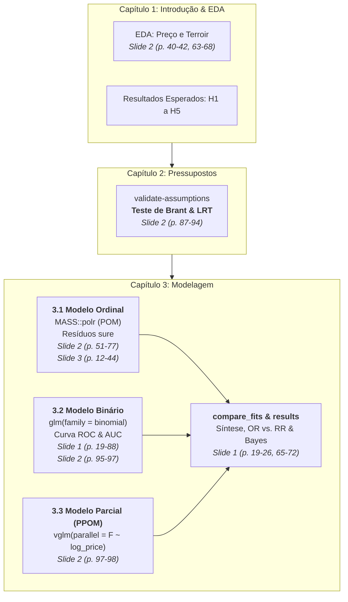

# Plano de Implementação e Caderno Teórico-Metodológico
## Trabalho Prático 1: Modelagem da Qualidade de Vinhos (RegCatOrd - UFMG)

> **Estrutura deste documento**: Este plano espelha **exatamente os capítulos e seções do seu arquivo [`TP1/R/wine.qmd`](file:///g:/Meu%20Drive/ufmg262/RegCatOrd/TP1/R/wine.qmd)**. Ele foi elaborado para você codificar diretamente em cada chunk, com fundamentação teórica formal, deduções matemáticas, solução para a divergência identificada na seção 3.2.2, e referências exatas dos slides da disciplina (Prof. Cristiano Santos).

---

## 0. Alerta Crítico: A Divergência entre a Seção 3.2.2 e a Seção 3.1

> [!WARNING]
> **Identificação da Divergência no Código**:
> No seu script [`wine.qmd`](file:///g:/Meu%20Drive/ufmg262/RegCatOrd/TP1/R/wine.qmd#L371-L384), a seção **3.2** tem como título *"Regressão com dados dicotonomizados"* e instrui: *"Dicotomize a variável resposta (juntando categorias), ajuste um modelo de regressão para dados binários/binomiais e compare os resultados obtidos"*.
>
> Contudo, dentro do chunk `bin_fit` (linha 372), foi colado o mesmo template de modelo ordinal da seção 3.1:
> ```r
> # Código atual na 3.2.2 (EQUIVOCADO para dados binários):
> modelo_vgam <- vglm(happy ~ trauma + race, family = cumulative(parallel = TRUE), data = wine)
> ```
> O `vglm(family = cumulative(...))` é um modelo para **respostas ordinais com múltiplas categorias** ($J \ge 3$). Ele estima $J-1$ interceptos e logitos acumulados. Ao aplicá-lo sobre uma resposta dicotomizada ($Y \in \{0, 1\}$), além de redundante, descaracteriza a exigência do trabalho de contrastar um modelo ordinal com um modelo binomial clássico.

### O Contraste Teórico Formal entre 3.1 e 3.2.2

| Critério | Seção 3.1: Regressão Ordinal (`ordinal_fit`) | Seção 3.2.2: Regressão Binária Correta (`bin_fit`) |
|---|---|---|
| **Variável Resposta** | Ordinal policotômica: $Y \in \{1, 2, 3, 4\}$ (Preserva a ordenação sensorial completa) | Dicotômica: $Y_{bin} = I(\text{points} \ge 90) \in \{0, 1\}$ (A barreira comercial dos 90 pts) |
| **Distribuição Amostral** | Multinomial Ordinal | Bernoulli / Binomial |
| **Formulação Matemática** | $\text{logit}[P(Y \le j \mid \mathbf{x})] = \alpha_j - \mathbf{x}^T\boldsymbol{\beta}, \quad j = 1, \dots, J-1$ | $\text{logit}[P(Y_{bin} = 1 \mid \mathbf{x})] = \beta_0 + \mathbf{x}^T\boldsymbol{\beta}_{bin}$ |
| **Parâmetros Estimados** | $J-1$ interceptos ($\alpha_1, \alpha_2, \dots$) e um vetor $\boldsymbol{\beta}$ comum | Apenas 1 intercepto global ($\beta_0$) e um vetor $\boldsymbol{\beta}_{bin}$ |
| **Pacote e Função no R** | `MASS::polr(points_ord ~ ..., Hess = TRUE)` | `glm(points_bin ~ ..., family = binomial(link = "logit"))` |
| **Custo Teórico** | Modelo mais complexo, exige verificação de paralelismo | **Perda de Eficiência Estatística**: joga fora a variação interna (80 pts = 89 pts; 90 pts = 100 pts) |
| **Conexão nos Slides** | **Slide 2**, p. 51–77 | **Slide 1**, p. 19–41, 79–88 e **Slide 2**, p. 95–97 |

---

## 1. Mapeamento Geral do Script vs. Slides da Disciplina



---

## Capítulo 1: Introdução e Análise Exploratória

* **Seções no `wine.qmd`**: `## EDA` e `## Resultados esperados`
* **Chunks**: `get-data`, `EDA-covar-price`, `EDA-mapa-qualidade`
* **Slides**: **Slide 2, p. 40–42** (dados esparsos); **Slide 2, p. 63–68** (variável latente $Y^*$).

### 1.1 O que Fazer no Chunk `get-data`
No script atual, `df` sobrescreve `points` com fatores e falta o tratamento contínuo do preço e agrupamento de terroir. Estruture:
1. `points_raw = points`: preservar a nota contínua de 80 a 100.
2. `log_price = log(price)`: linearizar a relação, acomodando a assimetria brutal (US\$ 4 a US\$ 3.300) e os retornos marginais decrescentes.
3. `points_ord`: a variável resposta ordinal (4 faixas enológicas ou 5 quantis).
4. `points_bin = if_else(points >= 90, 1L, 0L)`: indicador binário da barreira dos 90 pontos.
5. `terroir`: agrupar `country` em `Velho Mundo` (França, Itália, Espanha, Portugal, Alemanha, Áustria), `Novo Mundo` (EUA, Chile, Argentina, Austrália, África do Sul, Nova Zelândia) e `Outros`.
6. `variety_top`: Top 5 castas mais frequentes + "Outras".

### 1.2 Hipóteses Substantivas ($H_1$ a $H_5$)
* **$H_1$ (Elasticidade Positiva)**: $\beta_{\log(\text{price})} > 0$. Vinhos mais caros têm chances acumuladas substantivamente maiores de atingir estratos superiores ($\text{OR} > 2,0$).
* **$H_2$ (Prêmio do Velho Mundo)**: Controlando por preço, vinhos do Velho Mundo apresentam chances maiores de notas elevadas devido à reputação de suas denominações de origem (AOC, DOCG).
* **$H_3$ (Rejeição do Paralelismo pelo $N$ Grande)**: Devido ao tamanho amostral ($N \approx 121.000$), o Teste de Brant rejeitará $H_0$ ($p < 0,001$) mesmo para discrepâncias empíricas irrelevantes.
* **$H_4$ (Adequação do Modelo Parcial - PPOM)**: Relaxar o paralelismo apenas para $\log(\text{price})$ resolverá a quebra de suposição com o menor custo de parcimônia.
* **$H_5$ (Trade-off do Colapsamento)**: Dicotomizar preserva a direção do efeito, mas infla os erros-padrão por descartar a variabilidade entre notas 80–89 e 90–100.

---

## Capítulo 2: Pressupostos da Regressão Ordinal

* **Seção no `wine.qmd`**: `# Capítulo 2: Pressupostos`
* **Chunk**: `{r validate-assumptions}`
* **Slides**: **Slide 2, páginas 87 a 94** (*"Verificação da Suposição de Chances Proporcionais"*).

> **Atenção à Ordem Lógica**: No arquivo `.qmd`, este capítulo aparece antes do ajuste dos modelos. Para executar o Teste de Brant e o LRT no R, você precisará do modelo ordinal ajustado (`fit_polr` / `fit_vgam`). Você pode criar o objeto do modelo neste chunk ou referenciar o modelo ajustado na seção 3.1.

### 2.1 O que Significa Retas Paralelas?
No modelo de chances proporcionais:
$$\text{logit}[P(Y \le 1 \mid \mathbf{x})] = \alpha_1 - \beta x$$
$$\text{logit}[P(Y \le 2 \mid \mathbf{x})] = \alpha_2 - \beta x$$
$$\text{logit}[P(Y \le 3 \mid \mathbf{x})] = \alpha_3 - \beta x$$
O efeito $\beta$ é rigorosamente o mesmo para todos os cortes. No plano cartesiano $(\text{logit}, x)$, essas equações são **retas perfeitamente paralelas**, separadas apenas pelos interceptos $\alpha_j$. Substantivamente: o ganho percentual nas chances ao duplicar o preço é idêntico tanto na transição da nota 84 para 85 quanto da nota 91 para 92.

### 2.2 Diagnósticos de Paralelismo
1. **Teste de Brant (`brant::brant`)**:
   Ajusta modelos logísticos binários independentes para cada corte e testa via Wald a igualdade simultânea $H_0: \boldsymbol{\beta}_1 = \boldsymbol{\beta}_2 = \dots = \boldsymbol{\beta}_{J-1}$. Fornece estatística $\chi^2$ omnibus e individual para cada preditor.
2. **Teste da Razão de Verossimilhança no VGAM**:
   Compara o modelo restrito com `parallel = TRUE` contra o modelo irrestrito com `parallel = FALSE` via `VGAM::lrtest()`.
3. **O Paradoxo do $N$ Grande (Slide 2, p. 93–94)**:
   Com $N = 120.975$, o erro-padrão amostral é da ordem de $0,01$. O teste de Brant resultará em $\chi^2 = 1033$ ($p < 10^{-200}$). **Isso não significa que o modelo ordinal deva ser descartado!** Avalia-se a estabilidade prática das estimativas entre os cortes.

---

## Capítulo 3: Modelagem

---

### Seção 3.1: Regressão para Dados Ordinais

* **Chunks**: `{r ordinal_selection}`, `{r ordinal_fit}`, `{r ordinal_res_analysis}`
* **Slides**: **Slide 2, p. 51–77** (modelo cumulativo e convenção de sinais); **Slide 3, p. 12–44** (resíduos substitutos).

#### 3.1.1 Seleção de Variáveis (`ordinal_selection`)
Compare modelos ordinais aninhados via Teste de Razão de Verossimilhança (TRV / Deviance) e critério de Akaike (AIC):
* `mod_0`: `points_ord ~ 1` (Nulo)
* `mod_1`: `points_ord ~ log_price` (Apenas Preço)
* `mod_2`: `points_ord ~ log_price + terroir` (Preço + Origem)
* `mod_3`: `points_ord ~ log_price + terroir + variety_top` (Completo)
* Funções: `anova(mod_1, mod_2, mod_3)` e `AIC(mod_0, mod_1, mod_2, mod_3)`.

#### 3.1.2 Ajuste do Modelo (`ordinal_fit`)
* **Modelo**: Logitos Acumulados sob Chances Proporcionais (POM).
* **Fórmula do `MASS::polr`**: $\text{logit}[P(Y \le j \mid \mathbf{x})] = \alpha_j - \mathbf{x}^T\boldsymbol{\beta}$.
* **Convenção de Sinais**: Como a fórmula usa sinal negativo, um $\hat{\beta} > 0$ indica aumento da probabilidade acumulada em classes superiores de qualidade. A Razão de Chances Acumulada para notas altas é:
  $$\text{OR}_{>j} = \exp(\hat{\beta})$$
* **Código no R**:
  ```r
  mod_polr <- polr(points_ord ~ log_price + terroir, data = df, Hess = TRUE)
  summary(mod_polr)
  # Razão de Chances com Intervalo de Confiança de 95%
  exp(cbind(OR = coef(mod_polr), confint(mod_polr)))
  ```

#### 3.1.3 Análise de Resíduos Ordinais (`ordinal_res_analysis`)
* **Fundamentação**: Resíduos SBS/ordinários em dados ordinais formam faixas paralelas discretas (Slide 3, p. 12–13). Usamos **Resíduos Substitutos (*Surrogate Residuals*)** do pacote `sure` (Liu & Zhang, 2017), simulando uma variável contínua latente truncada $S_i \mid Y_i = j$.
* **Código no R** (subamostra de $n = 3.000$ para rapidez computacional):
  ```r
  set.seed(262)
  sub_df <- df[sample(nrow(df), 3000), ]
  fit_sub <- polr(points_ord ~ log_price + terroir, data = sub_df, Hess = TRUE)
  p1 <- sure:::autoplot.polr(fit_sub, what = "qq", nsim = 30) + ggtitle("QQ-Plot dos Resíduos Substitutos")
  p2 <- sure:::autoplot.polr(fit_sub, what = "fitted", nsim = 30) + ggtitle("Resíduos vs. Ajustados")
  p3 <- sure:::autoplot.polr(fit_sub, what = "covariate", x = sub_df$log_price, nsim = 30) + ggtitle("Resíduos vs. log(Preço)")
  gridExtra::grid.arrange(p1, p2, p3, ncol = 3)
  ```

---

### Seção 3.2: Regressão com Dados Dicotomizados

* **Chunks**: `{r bin_selection}`, `{r bin_fit}`, `{r bin_res_analysis}`
* **Slides**: **Slide 1, p. 19–41, 79–88**; **Slide 2, p. 95–97**.

#### 3.2.1 Seleção de Variáveis (`bin_selection`)
Compare modelos binários via TRV e AIC usando `glm(..., family = binomial)`.

#### 3.2.2 Ajuste do Modelo (`bin_fit`) — *Correção da Divergência*
Substitua o código atual do template por:
```r
# O MODELO CORRETO PARA A SEÇÃO 3.2 É O GLM BINOMIAL:
fit_bin <- glm(
    points_bin ~ log_price + terroir,
    family = binomial(link = "logit"),
    data = df
)
summary(fit_bin)
```
* **Interpretação**: $\hat{\beta}_{\text{log\_price}} \approx 2,178$. Para cada aumento de 1 unidade em $\log(\text{price})$, a chance de o vinho receber 90+ pontos é multiplicada por $\exp(2,178) \approx 8,83$.

#### 3.2.3 Análise de Resíduos e Desempenho Preditivo (`bin_res_analysis`)
* Curva ROC e Área sob a Curva (AUC) via pacote `pROC`:
  ```r
  prob_pred <- predict(fit_bin, type = "response")
  roc_obj <- roc(df$points_bin, prob_pred)
  plot(roc_obj, col = "#7A182F", lwd = 2.5, main = paste("Curva ROC (AUC =", round(auc(roc_obj), 3), ")"))
  ```
* Avaliação de Sensibilidade, Especificidade e matriz de confusão para o ponto de corte ótimo.

---

### Seção 3.3: Modelo Sem Chances Proporcionais (PPOM)

* **Título no script**: `## 3.3 Modelo que roda sem chances porporcionais pq vai bombar cpa`
* **Chunks**: `{r modelo_misterioso_selection}`, `{r modelo_misterioso_fit}`, `{r modelo_misterioso_res_analysis}`
* **Slides**: **Slide 2, p. 97–98** (*"Alternativas quando as chances proporcionais falham"*).

#### 3.3.1 Qual é o "Modelo Misterioso"?
O modelo mais adequado proposto pela literatura (Slide 2, p. 98) é o **Modelo de Chances Proporcionais Parciais (PPOM - *Partial Proportional Odds Model*)**.
* **Motivação**: O modelo irrestrito (`parallel = FALSE`) estima parâmetros independentes para todas as covariáveis em todos os cortes, gerando curvas que podem se cruzar e inflacionando parâmetros.
* O PPOM é o equilíbrio perfeito: relaxa o paralelismo **apenas para a variável violadora (`log_price`)**, mantendo os coeficientes de `terroir` constantes em todos os cortes.

#### 3.3.2 Ajuste do Modelo PPOM (`modelo_misterioso_fit`)
Substitua o template por:
```r
# Ajuste do Modelo de Chances Proporcionais Parciais (PPOM)
# parallel = FALSE ~ log_price relaxa o paralelismo EXCLUSIVAMENTE para o preço
fit_ppom <- vglm(
    points_ord ~ log_price + terroir,
    family = cumulative(parallel = FALSE ~ log_price),
    data = df
)
summary(fit_ppom)
```

#### 3.3.3 Análise de Resíduos do PPOM (`modelo_misterioso_res_analysis`)
Avalie a deviance residual e o AIC comparando o modelo proporcional estrito com o PPOM.

---

### Seção 3.4: Comparação entre os Três Modelos (`compare_fits`)

* **Chunk**: `{r compare_fits}`
Construa uma tabela integradora comparando lado a lado:
1. **Modelo Ordinal Estrito** (`polr`)
2. **Modelo Ordinal Parcial - PPOM** (`vglm`)
3. **Modelo Binário Dicotomizado** (`glm`)

```r
tabela_comparativa <- data.frame(
    Modelo = c("Ordinal Estrito (polr)", "Ordinal Parcial (PPOM - Preço Corte 3)", "Binário Dicotômico (glm)"),
    Beta_Preco = c(coef(mod_polr)["log_price"], coef(fit_ppom)["log_price:3"], coef(fit_bin)["log_price"]),
    SE_Preco = c(summary(mod_polr)$coefficients["log_price", "Std. Error"], NA, summary(fit_bin)$coefficients["log_price", "Std. Error"]),
    AIC = c(AIC(mod_polr), AIC(fit_ppom), AIC(fit_bin))
)
print(tabela_comparativa)
```
* **Discussão Conceitual**: Demonstre que o sinal e a magnitude do preço se mantêm estáveis ($\approx 2,14$ a $2,18$), comprovando que a variável latente subjacente é consistente entre todas as parametrizações.

---

## Capítulo 4: Resultados Finais, OR vs. RR e Extensão Bayesiana

* **Chunk**: `{r results}`
* **Slides**: **Slide 1, p. 19–26, 65–72** e **Trabalho1.pdf**.

### 4.1 Dedução de OR vs. Risco Relativo (RR) e Frases Equivocadas
* **Dedução Matemática**:
  $$RR = \frac{\pi_1}{\pi_0}, \quad OR = \frac{\pi_1 / (1 - \pi_1)}{\pi_0 / (1 - \pi_0)} = RR \times \left(\frac{1 - \pi_0}{1 - \pi_1}\right)$$
  Como a prevalência de vinhos $\ge 90$ é de $37,5\%$, o evento não é raro! O fator $\frac{1-\pi_0}{1-\pi_1} > 1$ faz com que o OR superestime o RR.

* **Tabela de Frases Equivocadas**:
  1. *Equívoco 1*: "Como o OR é 8,5, vinhos caros têm 8,5 vezes mais probabilidade de tirar 90+." $\to$ **Correção**: A chance ($\pi/(1-\pi)$) é 8,5 vezes maior, mas a probabilidade $\pi$ cresce a uma taxa muito menor (RR).
  2. *Equívoco 2*: "Podemos usar o OR como substituto direto do risco relativo." $\to$ **Correção**: Isso só é válido sob a suposição de evento raro ($\pi \to 0$), o que não ocorre na base de vinhos.

### 4.2 Ganhos da Abordagem Bayesiana
1. **Resolução de Quase-Separação Completa**: Priors regularizadoras $\text{Normal}(0, \sigma^2)$ impedem estimativas infinitas em castas/países raros.
2. **Modelagem Hierárquica Multinível Natural**: Acomoda a estrutura aninhada de *Vinho $\in$ Vinícola $\in$ Denominação de Origem $\in$ País* via efeitos aleatórios estáveis em Stan/`brms`.
3. **Inferência Exata**: Extração direta de intervalos de credibilidade HPD das cadeias MCMC sem depender de aproximações assintóticas de Wald ou Método Delta.

---

## 5. Gabarito Empírico para Validação do Seu Código

Ao executar seus chunks, compare com os seguintes valores de referência já validados:
* Registros válidos: $N = 120.975$.
* Prevalência de $\ge 90$ pts: $37,52\%$.
* Coeficiente de `log_price` no Modelo Ordinal (`polr`): $\hat{\beta} = 2,1406$ ($\text{OR} = 8,50$).
* Coeficiente de `terroirVelho Mundo` no Modelo Ordinal: $\hat{\beta} = 0,3277$ ($\text{OR} = 1,39$).
* Estatística Omnibus do Teste de Brant: $\chi^2 = 1033$ ($p < 10^{-200}$).
* Coeficiente de `log_price` no Modelo Binário (`glm`): $\hat{\beta} = 2,1783$ ($\text{OR} = 8,83$).
* Área sob a Curva ROC do Modelo Binário: $\text{AUC} \approx 0,792$.
